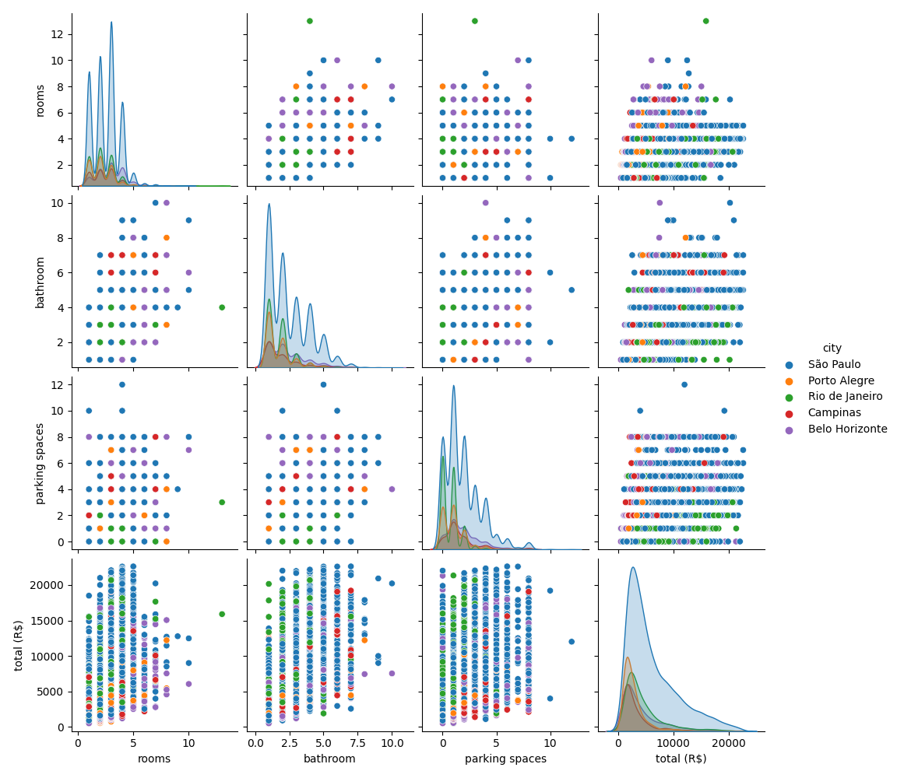
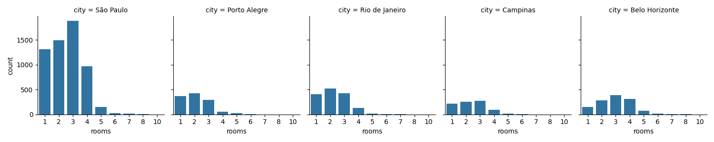
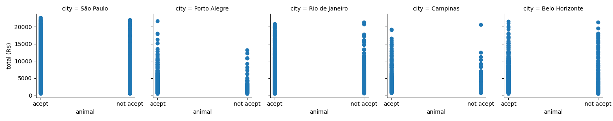
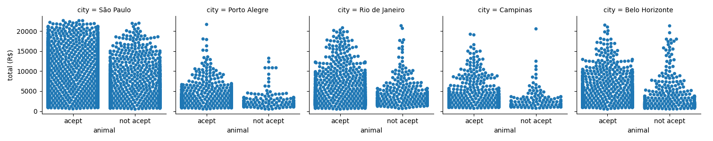

# Sobre

Desafio da Pós Graduação em Análise de Dados usando Seaborn

## Relações Pareadas

O script pairwise_relationships.py gera um gráfico de relações pareadas que cruza as informações de número de quartos, número de banheiros, vagas de garagens e o total do aluguel. Os dados são pintados pela cidade do imóvel. 

A partir da análise dessas relações observa-se, por exemplo, no quarto gráfico da primeira linha, que a cidade que possui o aluguel mais caro para um imóvel de um quarto é a cidade de São Paulo.

## Gráfico Facetado do número de quartos por cidade

O script faceted_graphic.py constrói um gráfico facetado por cidade mapeando o número de quartos que cada cidade tem. Para isso foi utilizado como visualização dos subgráficos a função sns.countplot. 

Um resultado observado no gráfico é a quantidade de quartos mais frequente nos apartamentos disponíveis em cada uma das cidades. Sendo 3 quartos em São Paulo, Campinas e Belo Horizonte e 2 quartos em Porto Alegre e Rio de Janeiro.

## Gráfico Facetado do preço do aluguel, por cidade, por aceitar ou não animais

O script animal_scatter.py constrói um gráfico facetado pelas cidades (colunas) e pela variável animal (linhas) com a distribuição do valor total do aluguel. 

O gŕafico permite analisar se existe alguma relação entre o preço do aluguel e o fato do condomínio aceitar animais, porém a ausência de densidade prejudica a análise. 

Sendo assim foi criado o script animal_swarm.py que permite observar a densidade dos valores.

O gráfico com as densidades dos dados permite uma melhor conclusão da relação entre o preço do aluguel e o fato do condomínio aceitar animais. A partir daí conclui-se que a quantidade de apartamentos com valores de aluguel mais altos que aceita animais é maior do que a quantidade que não aceita.
